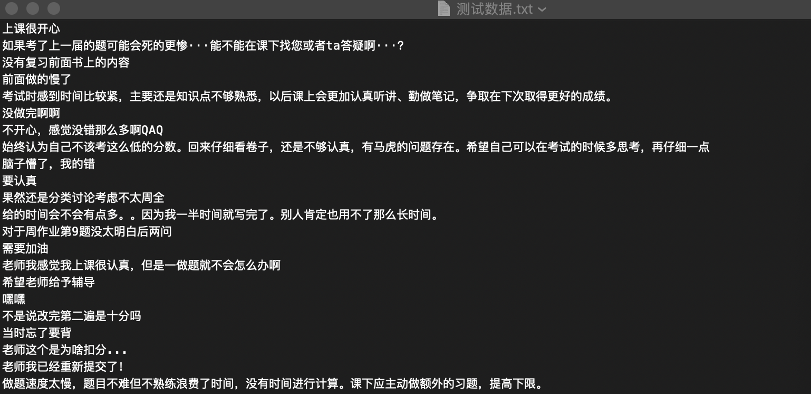
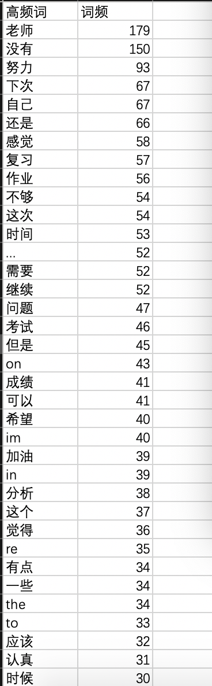

目录
[TOC]

支持对多行的中文文本文件进行分词，并通过 API 接口导出生成的词云图片(.png)和词频统计文件(.csv)。

## 特点
- 支持多行文本分词结果合并生成词云
- 支持词云图片(.png)和分词结果(.csv)导出
- 分词结果优化
- 支持中英文分词
- 支持自定义配置
    - 自定义词云图背景图形
    - 自定义停用词表
    - 自定义词云字体

## 安装
**安装依赖**
```
pip install pipenv
pipenv install --dev
```

**运行**
```
cp .env.example .env 创建自定义环境文件
pipenv shell # 进入虚拟环境
```
如果虚拟环境已经激活，再次运行只需要命令`flask run`

**API**
`POST /api/clouds`
POST 发送待分析的文本文件(txt)，将返回一个包含词频统计和图云图片的压缩包

## 使用示例
### 请求数据示例


### 运行结果
#### 词云图


#### 词频统计

